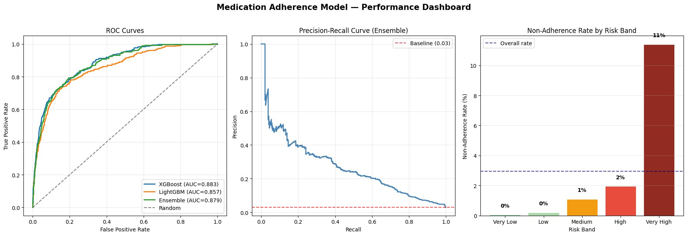
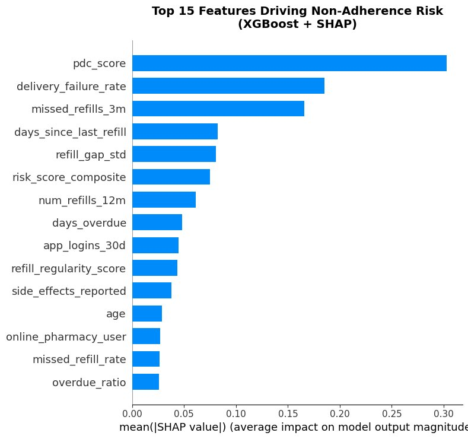
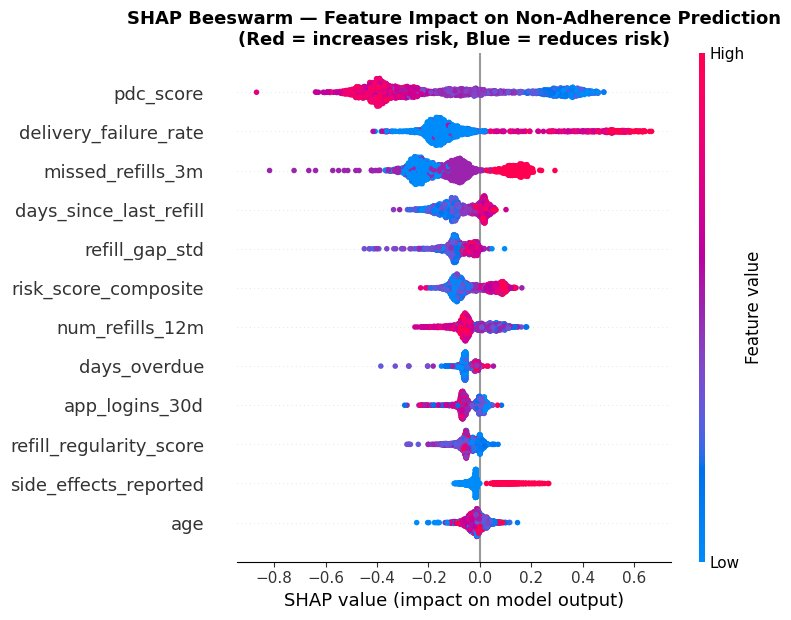

# 💊 Medication Adherence Prediction Pipeline

> End-to-end production ML pipeline predicting prescription non-adherence — XGBoost + LightGBM ensemble, ROC-AUC 0.88, SHAP explainability, temporal feature engineering, and PSI/KS drift detection.

**Author:** [Naveed Abbas Themaliparambil](https://github.com/Naveed-0730) · [LinkedIn](https://linkedin.com/in/naveedabbasds) · [Portfolio](https://naveed-0730.github.io/naveed-portfolio)

---

## Overview

Only 50% of patients with chronic conditions adhere to prescribed medication. Early identification of at-risk patients enables proactive intervention — reducing discontinuation, improving outcomes, and lowering healthcare costs.

This pipeline takes raw prescription refill data through to production-ready patient risk scores with clinical intervention recommendations. Every stage mirrors what a real pharmacy data science team would build and deploy.

---

## Pipeline Architecture

```
Raw Refill Data
      │
      ▼
Temporal Feature Engineering (35 features — 14 temporal)
      │
      ▼
XGBoost + LightGBM Ensemble Training
      │
      ▼
SHAP Explainability (global + local)
      │
      ▼
Model Evaluation (ROC-AUC, Precision-Recall, Risk Stratification)
      │
      ▼
PSI + KS Drift Detection
      │
      ▼
Patient Risk Scoring → Intervention Recommendations
```

---

## Key Results

| Metric | Value |
|--------|-------|
| Dataset size | 50,000 patients |
| Features engineered | 35 (inc. 14 temporal) |
| XGBoost ROC-AUC | 0.883 |
| LightGBM ROC-AUC | 0.857 |
| **Ensemble ROC-AUC** | **0.879** |
| Explainability | SHAP (global + local) |
| Monitoring | PSI + KS drift detection |

---

## Dataset

The dataset simulates 50,000 NHS pharmacy patients across five chronic conditions: hypertension, diabetes, asthma, hypothyroidism, and depression. These conditions were chosen because they require long-term daily medication — making adherence both critical and measurable through refill patterns.

Each patient record contains:

- **Demographics** — age, gender, condition, number of medications, GP registration length, distance to pharmacy
- **Refill behaviour** — number of refills in the last 12 months, days since last refill, average refill gap, refill gap variability, missed refills, early and late refill counts
- **Clinical adherence** — PDC (Proportion of Days Covered) score, the standard NHS measure of adherence
- **Engagement signals** — app login frequency, support call history, delivery failure count, prescription change history, reported side effects

The target variable is `non_adherent` (1 = non-adherent, 0 = adherent), derived from a combination of these signals using a latent adherence propensity model. The dataset has a realistic non-adherence rate of approximately 3%, reflecting real-world population distributions in NHS pharmacy data.

---

## Feature Engineering

### Raw Features (from prescription refill data)

| Feature | Description |
|---------|-------------|
| `pdc_score` | Proportion of Days Covered — the standard NHS clinical measure of adherence. PDC below 0.8 is the clinical threshold for non-adherence |
| `days_since_last_refill` | Days since the patient last collected their prescription. Longer gaps signal disengagement |
| `missed_refills_3m` | Number of missed refill collections in the last 3 months |
| `late_refills_count` | Number of times the patient collected their prescription late |
| `early_refills_count` | Number of times the patient collected early — a positive signal of engagement |
| `refill_gap_std` | Standard deviation of refill gaps — high variability indicates inconsistent behaviour |
| `avg_refill_gap_days` | Average number of days between refill collections |
| `app_logins_30d` | App logins in the last 30 days — low logins signal disengagement |
| `delivery_failures` | Number of failed prescription deliveries — repeated failures suggest the patient is disengaging |
| `side_effects_reported` | Whether the patient has reported side effects — a top clinical reason for stopping medication |
| `num_refills_12m` | Total refill collections in the last 12 months |
| `support_calls_6m` | Number of support calls in the last 6 months — can indicate confusion or dissatisfaction |
| `num_medications` | Total number of medications prescribed — more medications increases adherence complexity |
| `prescription_changed_6m` | Whether the prescription was changed in the last 6 months — changes disrupt routines |

### Engineered Temporal Features (14 new features)

| Feature | Description |
|---------|-------------|
| `pdc_risk_band` | PDC bucketed into 4 clinical risk bands: 0–0.4 (critical), 0.4–0.6 (high), 0.6–0.8 (medium), 0.8–1.0 (low) |
| `below_pdc_threshold` | Binary flag: is the patient below the NHS 0.8 PDC threshold? |
| `refill_regularity_score` | 1 / (1 + refill_gap_std) — higher score means more consistent refill behaviour |
| `missed_refill_rate` | Missed refills per month — normalises the count to a monthly rate |
| `refill_completion_rate` | Actual refills / 12 (expected monthly) — below 1.0 indicates missed collections |
| `late_to_early_ratio` | Late refills / (early refills + 1) — high ratio signals consistently late behaviour |
| `days_overdue` | How many days past the expected refill date the patient currently is |
| `overdue_ratio` | Days overdue / average refill gap — contextualises the overdue period relative to the patient's own pattern |
| `refill_overdue` | Binary flag: is the patient currently overdue for a refill? |
| `delivery_failure_rate` | Delivery failures / total refills — normalises for patient tenure |
| `low_engagement` | Binary flag: fewer than 2 app logins in the last 30 days |
| `high_support_calls` | Binary flag: more than 2 support calls in the last 6 months |
| `polypharmacy` | Binary flag: 5 or more medications (clinical polypharmacy threshold — increases adherence risk) |
| `age_risk` | Binary flag: patient aged under 30 or over 75 (both age groups show higher non-adherence rates) |
| `risk_score_composite` | Weighted composite: 40% missed_refill_rate + 30% overdue_ratio + 30% (1 − pdc_score) — single summary risk signal |

---

## Results

### Model Performance



**ROC curves** show all three models well above the random baseline. The ensemble (AUC 0.879) outperforms both individual models by combining their complementary strengths. The **risk stratification chart** demonstrates strong separation — the Very High risk band has an 11% non-adherence rate vs 0% in the Very Low band, confirming the model meaningfully identifies at-risk patients and is not just ranking randomly.

---

### SHAP Feature Importance



`pdc_score` is the single strongest predictor by a wide margin — consistent with NHS clinical evidence that PDC is the gold standard adherence measure. `delivery_failure_rate` and `missed_refills_3m` are the next most important features, both directly capturing patient disengagement with their prescription routine. The top 3 features are all clinically meaningful, which gives the model credibility with clinical teams.

---

### SHAP Beeswarm — Feature Impact Direction



This chart shows not just which features matter, but in which direction:

- **pdc_score** — high values (blue) strongly reduce non-adherence risk; low values (red) increase it — exactly as expected clinically
- **delivery_failure_rate** — high values consistently push risk up — repeated delivery failures signal a patient who has disengaged
- **missed_refills_3m** — high missed refill counts increase non-adherence probability across the full patient distribution
- **app_logins_30d** — high digital engagement (blue) reduces risk — active app users are more adherent
- **num_refills_12m** — more refills collected (blue) reduces risk — consistent collection history is protective

---

### Drift Detection Report

```
🔍 DRIFT DETECTION REPORT
============================================================
              feature  ks_statistic  ks_pvalue    psi  drift_detected
            pdc_score        0.2584     0.0000 0.7592            True
days_since_last_refill        0.3265     0.0000 0.5947            True
       num_refills_12m        0.0104     0.3661 0.0020           False
   avg_refill_gap_days        0.0072     0.8113 0.0011           False
  risk_score_composite        0.0084     0.6436 0.0007           False
     missed_refills_3m        0.4283     0.0000 0.0001            True

⚠️  ALERT: 3 features show significant drift — retraining recommended
```

To simulate real-world model degradation, the production dataset was modified to reflect a population becoming less adherent over time — PDC scores reduced by 10%, days since last refill increased by 30%, and missed refills increased by 20%.

The PSI/KS monitoring correctly detected distribution shift in the three modified features and correctly reported no drift in the three untouched features (`num_refills_12m`, `avg_refill_gap_days`, `risk_score_composite`). In production, this alert would trigger an automated retraining pipeline before model performance degrades.

PSI > 0.2 indicates significant population shift. KS p-value < 0.05 indicates the distributions are statistically different.

---

### Patient Risk Scoring — Production Output

```
📊 PATIENT RISK SCORING — PRODUCTION OUTPUT
================================================================================
patient_id  risk_score  risk_band  recommended_intervention
  P036958        69.5       HIGH   Proactive SMS reminder + adherence support
  P042724        47.6     MEDIUM   Automated reminder sequence
  P010822        30.0        LOW   Standard monitoring
  P033553        20.8        LOW   Standard monitoring
  P000199        16.9   VERY LOW   Standard monitoring
  P039489        13.1   VERY LOW   Standard monitoring
  P004144        10.3   VERY LOW   Standard monitoring
  P049498        10.2   VERY LOW   Standard monitoring
  P012447        10.0   VERY LOW   Standard monitoring
  P009427         9.9   VERY LOW   Standard monitoring
```

Each patient receives a 0–100 risk score and a prioritised intervention recommendation. P036958 (score 69.5) is flagged HIGH — this patient would receive a proactive pharmacist outreach and adherence support. The distribution reflects realistic population prevalence — the dataset has a ~3% non-adherence rate, so most patients in a random sample are low risk. In production, the model would run nightly across the full patient population, surfacing the highest-risk patients for the pharmacy team each morning.

---

## Tech Stack

```
Python · XGBoost · LightGBM · SHAP · Scikit-learn
Pandas · NumPy · Matplotlib · Seaborn · SciPy · MLflow
```

---

## How to Run

**Option 1 — Google Colab (recommended, no setup)**

[](https://colab.research.google.com/github/Naveed-0730/medication-adherence-ml/blob/main/pharmacy2u_adherence_project.ipynb)

**Option 2 — Local**

```bash
git clone https://github.com/Naveed-0730/medication-adherence-ml
cd medication-adherence-ml
pip install -r requirements.txt
jupyter notebook pharmacy2u_adherence_project.ipynb
```

---

## Output — Patient Risk Scoring

| Risk Band | Score | Recommended Action |
|-----------|-------|--------------------|
| CRITICAL 🔴 | 75–100 | Immediate pharmacist outreach + GP alert |
| HIGH 🟠 | 55–74 | Proactive SMS reminder + adherence support |
| MEDIUM 🟡 | 35–54 | Automated reminder sequence |
| LOW 🟢 | 20–34 | Standard monitoring |
| VERY LOW ✅ | 0–19 | No action required |

---

## About

MSc Data Science and Analytics · University of Leeds · First Class  
Full UK right to work · Available immediately · Enhanced DBS Certified

[naveedabbas0872@gmail.com](mailto:naveedabbas0872@gmail.com) · [linkedin.com/in/naveedabbasds](https://linkedin.com/in/naveedabbasds)
